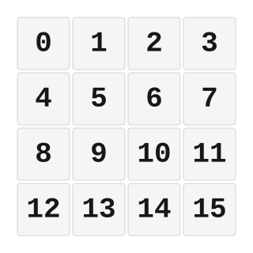

# ZMK Configuration for dinguspad

*Generated by Shield Wizard for ZMK*



Download compiled firmware from the Actions tab. <https://zmk.dev/docs/user-setup#installing-the-firmware>

Edit your keymap <https://zmk.dev/docs/keymaps>.
User keymap is located at [`config/dinguspad.keymap`](config/dinguspad.keymap).

-----

<details>
<summary>
Shield Wizard Debug Information
</summary>

In case of broken configuration, here is the Shield Wizard internal data used to generate this configuration:

Commit: 63ab9b7bd8845252979f45da72f40210b0b1a3ae

```json
{"name":"dinguspad","shield":"dinguspad","dongle":false,"modules":[],"layout":[{"id":"01KTRY0SGRN6H51KGSX2BB03QR","part":0,"row":0,"col":0,"w":1,"h":1,"x":0,"y":0,"r":0,"rx":0,"ry":0},{"id":"01KTRY0SRCR5FBSTSXZMKRDYXR","part":0,"row":0,"col":1,"w":1,"h":1,"x":1,"y":0,"r":0,"rx":0,"ry":0},{"id":"01KTRY0SZHQS9K9TJ8JAMETMNT","part":0,"row":0,"col":2,"w":1,"h":1,"x":2,"y":0,"r":0,"rx":0,"ry":0},{"id":"01KTRY0T6QJYYWYZJE2NDTSCTK","part":0,"row":0,"col":3,"w":1,"h":1,"x":3,"y":0,"r":0,"rx":0,"ry":0},{"id":"01KTRY0VKW4J8C6PNGD8EN677C","part":0,"row":1,"col":0,"w":1,"h":1,"x":0,"y":1,"r":0,"rx":0,"ry":0},{"id":"01KTRY0VTCKBJK946XPZ7F29B9","part":0,"row":1,"col":1,"w":1,"h":1,"x":1,"y":1,"r":0,"rx":0,"ry":0},{"id":"01KTRY0W0SS4A23CNP337G32MG","part":0,"row":1,"col":2,"w":1,"h":1,"x":2,"y":1,"r":0,"rx":0,"ry":0},{"id":"01KTRY0W7KDDE1QCGWPHBC2169","part":0,"row":1,"col":3,"w":1,"h":1,"x":3,"y":1,"r":0,"rx":0,"ry":0},{"id":"01KTRY1AANZ3J0S6CEE9WNZD65","part":0,"row":2,"col":0,"w":1,"h":1,"x":0,"y":2,"r":0,"rx":0,"ry":0},{"id":"01KTRY1AGEPBZMDJT399WXQAWZ","part":0,"row":2,"col":1,"w":1,"h":1,"x":1,"y":2,"r":0,"rx":0,"ry":0},{"id":"01KTRY1AP3Z5C0ZCAAQ6KM5WJ7","part":0,"row":2,"col":2,"w":1,"h":1,"x":2,"y":2,"r":0,"rx":0,"ry":0},{"id":"01KTRY1AWAZ63GPVD5TF2NK140","part":0,"row":2,"col":3,"w":1,"h":1,"x":3,"y":2,"r":0,"rx":0,"ry":0},{"id":"01KTRY1N6X3G88VKYQ3F5ZSJJ6","part":0,"row":3,"col":0,"w":1,"h":1,"x":0,"y":3,"r":0,"rx":0,"ry":0},{"id":"01KTRY1NCV1KBQXQC92ENM3PQ9","part":0,"row":3,"col":1,"w":1,"h":1,"x":1,"y":3,"r":0,"rx":0,"ry":0},{"id":"01KTRY1NJC9K1KFYGM5SRXSZHQ","part":0,"row":3,"col":2,"w":1,"h":1,"x":2,"y":3,"r":0,"rx":0,"ry":0},{"id":"01KTRY1NXZFXTBAMXAJJFTQXC6","part":0,"row":3,"col":3,"w":1,"h":1,"x":3,"y":3,"r":0,"rx":0,"ry":0}],"parts":[{"name":"unibody","controller":"nice_nano_v2","wiring":"matrix_diode","pins":{"d5":"encoder","d4":"encoder","d1":"encoder","d0":"encoder","d9":"input","d8":"input","d7":"input","d6":"input","d15":"output","d14":"output","d16":"output","d10":"output"},"keys":{"01KTRY0SGRN6H51KGSX2BB03QR":{"input":"d9","output":"d15"},"01KTRY0VKW4J8C6PNGD8EN677C":{"input":"d9","output":"d14"},"01KTRY1AANZ3J0S6CEE9WNZD65":{"input":"d9","output":"d16"},"01KTRY1N6X3G88VKYQ3F5ZSJJ6":{"input":"d9","output":"d10"},"01KTRY0SRCR5FBSTSXZMKRDYXR":{"input":"d8","output":"d15"},"01KTRY0VTCKBJK946XPZ7F29B9":{"input":"d8","output":"d14"},"01KTRY1AGEPBZMDJT399WXQAWZ":{"input":"d8","output":"d16"},"01KTRY1NCV1KBQXQC92ENM3PQ9":{"input":"d8","output":"d10"},"01KTRY0SZHQS9K9TJ8JAMETMNT":{"input":"d7","output":"d15"},"01KTRY0W0SS4A23CNP337G32MG":{"input":"d7","output":"d14"},"01KTRY1AP3Z5C0ZCAAQ6KM5WJ7":{"input":"d7","output":"d16"},"01KTRY1NJC9K1KFYGM5SRXSZHQ":{"input":"d7","output":"d10"},"01KTRY0T6QJYYWYZJE2NDTSCTK":{"input":"d6","output":"d15"},"01KTRY0W7KDDE1QCGWPHBC2169":{"input":"d6","output":"d14"},"01KTRY1AWAZ63GPVD5TF2NK140":{"input":"d6","output":"d16"},"01KTRY1NXZFXTBAMXAJJFTQXC6":{"input":"d6","output":"d10"}},"encoders":[{"pinA":"d5","pinB":"d4"},{"pinA":"d1","pinB":"d0"}],"buses":[{"name":"spi0","devices":[],"type":"spi"},{"name":"spi1","devices":[],"type":"spi"},{"name":"spi2","devices":[],"type":"spi"},{"name":"spi3","devices":[],"type":"spi"},{"name":"i2c0","devices":[],"type":"i2c"},{"name":"i2c1","devices":[],"type":"i2c"}]}]}
```

</details>
